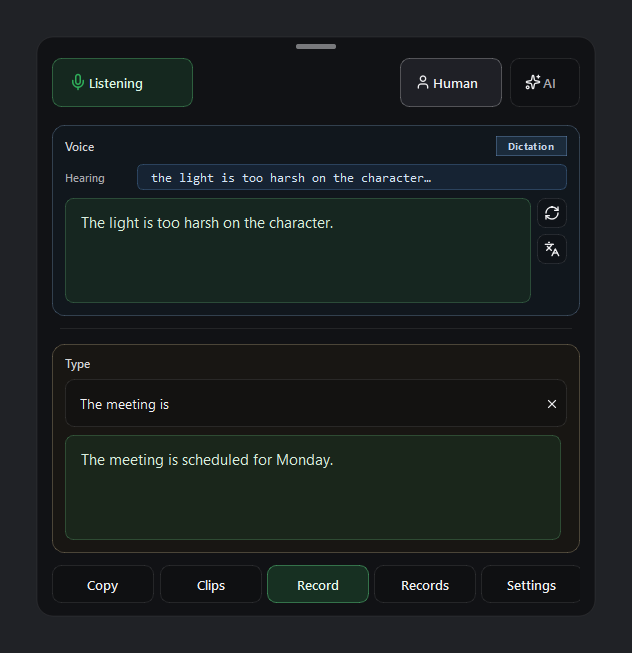

# PersonalClipboard

Local Windows dictation overlay: microphone → CUDA Faster-Whisper → Ollama on `127.0.0.1` → clipboard. Speak or type a sentence, finish it, then paste with Ctrl+V. Audio, transcripts, and clipboard text stay on this PC.

Hardware target: **Intel i9-14900K** + **NVIDIA RTX 4070 Ti SUPER** (16 GB).



The HUD is a translucent always-on-top tool window. **Mic** is the privacy kill switch. After a short silence, VAD stops the streaming microphone and idles Whisper; speech wakes them. **Settings** on the HUD picks language (English, Français, Español, Deutsch), opacity, Whisper model, Ollama corrector, idle-mic-when-quiet, and type-ahead. **Voice** shows the live partial and the last sentence. **Type** is the same correct-and-copy flow; while that field is focused, grey suggestions come from the same local model and **Tab** inserts them. **Meeting → Record** transcribes the room to a desktop markdown file.

## Easy install (Windows)

You need a recent **NVIDIA driver** (CUDA 12 capable), **Python 3.11 or 3.12**, and [Ollama for Windows](https://ollama.com/download). You do **not** need to install the CUDA Toolkit if `pip` can install the `nvidia-*-cu12` wheels listed in `pyproject.toml`.

```powershell
gh repo clone BazoukaJo/PersonalClipboard
cd PersonalClipboard

py -3.11 -m venv .venv
.\.venv\Scripts\Activate.ps1
python -m pip install --upgrade pip
pip install -e .

ollama pull qwen2.5-coder:1.5b

pythonw -m personalclipboard
```

To ship a Windows executable (onedir, Whisper weights stay in the Hugging Face cache, Ollama stays a separate localhost service):

```powershell
.\scripts\build_exe.ps1
```

That writes `dist\PersonalClipboard\PersonalClipboard.exe` and retargets the local **PersonalClipboard** desktop shortcut at the exe (working directory = the exe folder). Do not commit `dist/` or the `.lnk`. Tray **Restart** prefers the exe when it exists.

A **PersonalClipboard** shortcut on the Windows desktop is local only (gitignored). Recreate it with `python scripts\write_shortcut.py` after moving the folder.

The first launch downloads Faster-Whisper `large-v3-turbo` into the Hugging Face cache and loads it on the GPU. Use `python -m personalclipboard` instead of `pythonw` if you want a console for errors.

Only one overlay can run. Starting it again (desktop shortcut, tray **Restart**, the exe, or `pythonw -m personalclipboard`) stops the current process and starts a fresh one.

Windows Settings → Privacy → Microphone → allow desktop apps. After Whisper is ready, **Mic** turns on. Uncheck it to stop capture (no VAD probe). If PyAudio cannot open a device, capture falls back to **sounddevice**.

Full CUDA / cuDNN notes: [docs/SETUP.md](docs/SETUP.md).

## Use

| Action | What happens |
|---|---|
| Speak, end with `.` `?` `!` | Corrected sentence → clipboard. Paste with Ctrl+V. |
| Type, then Enter or `.` `?` `!` | Same correct-and-copy path. |
| Type, **Tab** (field focused) | Insert the grey suggestion from the local corrector. |
| **Copy** | Puts the last finished sentence on the clipboard again. |
| Say **paste last** | Focuses the last other window and pastes. |
| Say **copy last** | Copies the selection from the last other window. |
| Say **correct last** or **Ctrl+Shift+A** | Rewrites the current clipboard (works with Mic off). |
| **Record** | Meeting notes on the desktop. Speech goes to the file, not the clipboard. Headset calls only hear this microphone. |
| **Settings** | Language, opacity, Whisper model, Ollama model, idle-mic-when-quiet, suggest-while-typing. Saved in LOCALAPPDATA. |

Correction model: `qwen2.5-coder:1.5b` at `http://127.0.0.1:11434`. ASR partials never go to Ollama. Type-ahead uses the same model only while the Type field is focused.

## Dev

```powershell
.\.venv\Scripts\Activate.ps1
pip install -e ".[dev]"
python -m pytest tests -q
```

Regenerate the overlay image:

```powershell
python scripts\capture_overlay.py
```

## Docs

| File | What it is |
|---|---|
| [docs/SETUP.md](docs/SETUP.md) | Driver, venv, Whisper smoke test, Ollama |
| [docs/ARCHITECTURE.md](docs/ARCHITECTURE.md) | Threads, VRAM, latency |
| [docs/PRD.md](docs/PRD.md) | Requirements |
| `AGENTS.md` | Constraints for coding agents |

## License

Private local tool. Not for distribution of microphone data.
